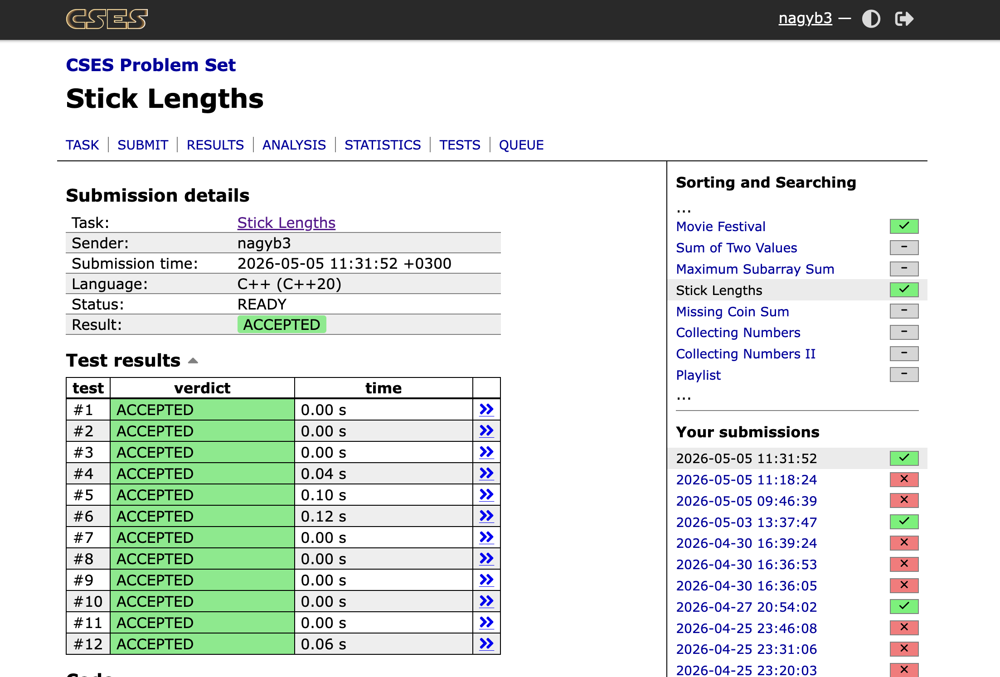

# Stick Lengths

## A Probléma:

https://cses.fi/problemset/task/1074

## Cél:

**Minimalizálni** szeretnénk az összes költséget, vagyis a következő értéket:

$$\sum_{i=1}^{n} | (x_i - p) \space | $$

ahol $$x_i$$ az `i`.-edik rúd hossza eredetileg, illetve `p` a rudak közös célhossza.

## Megoldás:

Használjuk a mediánt a közös célhosszként (`p`).

## Időkomplexitás:

$$O(n * log \space n)$$

A rendezés miatt. De léteznek lineáris rendezések is.

## Tárhelykomplexitás

$$ O (n) $$

## Kategória:

Search & Sorting

## CSES megoldás

Megoldás

 

